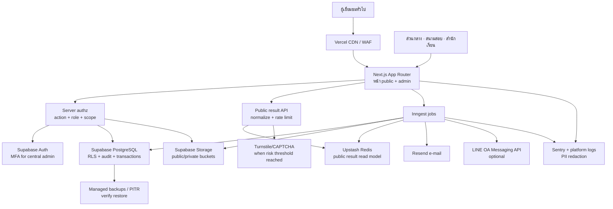

# Architecture Decision Record: ระบบบริหารการสอบนักธรรม–ธรรมศึกษา

| รายการ              | ค่าที่ตัดสินใจ                                                                                                                         |
| ------------------- | -------------------------------------------------------------------------------------------------------------------------------------- |
| เอกสารอ้างอิง       | `PRD.md` ฉบับ 26 ก.ย. 2569                                                                                                             |
| เป้าหมายสถาปัตยกรรม | ระบบเดียวดูแลได้โดยผู้พัฒนาคนเดียว, deploy ซ้ำได้, รักษาข้อมูลส่วนบุคคล, และรองรับทราฟฟิกอ่านผลสอบที่พุ่งสูง                           |
| แนวทางที่เลือก      | Next.js บน Vercel + Supabase (Postgres/Auth/Storage) + Upstash Redis + Inngest + Resend + LINE Messaging API                           |
| ข้อสำคัญ            | **ห้ามใช้ LINE Notify**: บริการสิ้นสุดแล้วตั้งแต่ 31 มี.ค. 2568; หากต้องแจ้งผ่าน LINE ให้ใช้ LINE Official Account + Messaging API แทน |

## 1. หลักการออกแบบ

1. **Monolith แบบแยกความรับผิดชอบ** — เริ่มด้วย Next.js แอปเดียว ไม่แยก microservice; แยกเป็นโมดูลและมี worker งานเบื้องหลังเฉพาะเมื่อจำเป็น
2. **ฐานข้อมูลธุรกรรมไม่รับโหลดค้นหาผลโดยตรง** — หลังอนุมัติ/เผยแพร่ผล ให้สร้าง public read model ที่ไม่มีข้อมูลอ่อนไหวลง Redis; หน้า public ค้นจาก read model ก่อนเสมอ
3. **ข้อมูลส่วนบุคคลเป็น private by default** — ผลค้นหาเปิดเฉพาะชื่อที่กำหนด, ปี, ประเภท, ระดับ, สถานะผล และหน่วยงานตามนโยบาย; ห้ามส่งเลขบัตร วันเกิด ที่อยู่ หรือคะแนนละเอียดไปยัง Redis/CDN
4. **สิทธิ์ตรวจทั้งสองชั้น** — Next.js ตรวจ action/role/scope บน server; Supabase RLS เป็นชั้นป้องกันข้อมูลซ้ำ. ไม่ใช้การซ่อนเมนูแทน authorization
5. **เผยแพร่เป็น transaction ที่ตรวจสอบได้** — สิทธิ์ maker-checker, audit log, และการสร้าง read model จะเกิดจากคำสั่ง publish ที่มี idempotency key; publish ล้มเหลวต้องไม่มีสถานะกึ่งเผยแพร่
6. **managed services เป็นค่าเริ่มต้น** — ลดภาระ patch OS, database backup, queue cluster และการดูแลเซิร์ฟเวอร์ 24 ชั่วโมง

## 2. เปรียบเทียบทางเลือก

| หัวข้อ                      | ทางเลือก A — **แนะนำ**                                             | ทางเลือก B                                                                         | ทางเลือก C                                                             |
| --------------------------- | ------------------------------------------------------------------ | ---------------------------------------------------------------------------------- | ---------------------------------------------------------------------- |
| แนวคิด                      | Next.js + Vercel + Supabase + Redis/queue แบบ managed              | Next.js บน Cloudflare + Workers/R2/D1/Queues                                       | Laravel + Filament + PostgreSQL บน VPS/managed PaaS                    |
| Frontend                    | Next.js App Router, TypeScript, React                              | Next.js ผ่าน OpenNext, TypeScript                                                  | Blade/Livewire หรือ Inertia, TypeScript เฉพาะส่วนจำเป็น                |
| Backend/API                 | Route Handlers + Server Actions ใน Next.js                         | Workers/Route Handlers ที่ขอบเครือข่าย                                             | Laravel controllers/queues/API                                         |
| ฐานข้อมูล                   | Supabase PostgreSQL + RLS                                          | Cloudflare D1 (SQLite) หรือเพิ่ม managed Postgres                                  | PostgreSQL managed + Laravel Eloquent                                  |
| Auth                        | Supabase Auth (email/password + MFA สำหรับ admin)                  | Clerk/Auth.js หรือ Supabase Auth แยกต่างหาก                                        | Laravel Fortify/Jetstream                                              |
| ที่เก็บไฟล์                 | Supabase Storage (private/public buckets)                          | Cloudflare R2                                                                      | S3-compatible storage                                                  |
| งานเบื้องหลัง               | Inngest (import, สร้าง read model, แจ้งเตือน)                      | Cloudflare Queues/Workers                                                          | Laravel Queue + Redis/Horizon                                          |
| รับโหลดผลสอบ                | Vercel CDN/WAF + Redis read model + rate limit                     | CDN/Workers ใกล้ผู้ใช้ + KV/D1 cache                                               | ต้องออกแบบ cache/Redis/CDN และ scale app เองมากกว่า                    |
| ดูแลคนเดียว                 | ต่ำถึงปานกลาง: console หลายตัวแต่ไม่มี OS                          | ปานกลาง: runtime/compatibility ของ Next.js บน Workers เพิ่มจุดเรียนรู้             | ปานกลางถึงสูง: patch, queue worker, scale/backup หากใช้ VPS            |
| ความแม่นของ AI coding agent | สูงมาก: Next.js/Supabase/TypeScript มีตัวอย่างและเอกสารกว้าง       | ปานกลาง: bindings/runtime ต่างจาก Node ปกติ                                        | สูงสำหรับ Laravel แต่เปลี่ยนภาษา/แนวทางจากแผน Codex ที่เป็น TypeScript |
| ความเสี่ยงหลัก              | vendor หลายรายและค่าใช้จ่ายตามการใช้                               | D1 ไม่เหมาะเป็นฐานหลักของ workflow เชิงสัมพันธ์และ audit ที่ซับซ้อน; compatibility | operational load และ burst result traffic ไปลงที่ระบบที่ดูแลเอง        |
| เหมาะเมื่อ                  | ต้องการส่งมอบเร็ว, ทีม 1 คน, เน้น workflow และความถูกต้องของข้อมูล | ทีมเชี่ยวชาญ Cloudflare และเน้น edge-first เป็นหลัก                                | มีผู้ดูแล PHP/infra หรือองค์กรกำหนดให้ host เอง                        |

### เหตุผลที่เลือกทางเลือก A

PRD ต้องการ PostgreSQL เชิงสัมพันธ์, revision/history, audit, RBAC ตามหน่วยงาน/สนามสอบ และ workflow ที่ต้องทำรายการแบบ atomic มากกว่าระบบ read-only ทั่วไป จึงใช้ Supabase PostgreSQL เป็น source of truth และไม่ใช้ D1 เป็นฐานหลัก. Next.js กับ Vercel ทำให้ preview จาก Git และ production deployment เป็นเส้นทางเดียวกัน. ส่วน peak ของการประกาศผลแยกออกด้วย Redis read model เพื่อไม่ให้การค้นหาสาธารณะทำให้ธุรกรรมหลังบ้านช้า.

## 3. Stack ที่เลือก

| ชั้น             | เทคโนโลยี                                                                                          | เหตุผลและกติกาใช้งาน                                                                                                                                |
| ---------------- | -------------------------------------------------------------------------------------------------- | --------------------------------------------------------------------------------------------------------------------------------------------------- |
| ภาษา/เครื่องมือ  | TypeScript, Node.js LTS, pnpm, ESLint, Prettier, Vitest, Playwright                                | โค้ดชนิดเดียวทั้ง frontend/backend; เครื่องมือมีเอกสารและตัวอย่างมาก; lockfile ต้อง commit                                                          |
| Frontend         | Next.js App Router, React, Tailwind CSS, shadcn/ui                                                 | SSR/SEO สำหรับสาธารณะ, server components สำหรับอ่านข้อมูล, UI หลังบ้านสม่ำเสมอ; ไม่ต้องสร้าง API แยกสำหรับทุกฟอร์ม                                  |
| Backend/API      | Next.js Route Handlers สำหรับ API และ Server Actions สำหรับ mutation ที่ผูกกับ form                | ใช้ schema validation ด้วย Zod ทุก input; ทุก mutation เรียก `authorize(actor, action, resource, scope)` ก่อน transaction                           |
| Database         | Supabase PostgreSQL, SQL migrations, Postgres RLS, `@supabase/ssr`/`supabase-js`                   | ได้ Postgres จริง, Auth/Storage อยู่ใกล้กัน, connection pooling; migration เป็นไฟล์ใน Git และไม่แก้ schema ผ่าน dashboard แบบไม่มี migration        |
| Data access      | SQL/RPC ที่ versioned สำหรับ transaction สำคัญ; query layer บน server เท่านั้นสำหรับข้อมูล private | ใช้ SQL function แบบ `security invoker` ที่จำเป็นสำหรับ approve/publish/import; service-role key อยู่เฉพาะ server/worker, ห้ามส่งไป browser         |
| Auth             | Supabase Auth: email/password สำหรับบัญชีที่ผ่านอนุมัติ, MFA บังคับสำหรับ Central Admin            | คำขอบัญชีเป็นตาราง application แยกจาก `auth.users`; role/scope เก็บใน app schema ไม่ใส่สิทธิ์ละเอียดใน UI token อย่างเดียว                          |
| File storage     | Supabase Storage: `public-documents`, `private-submissions`, `private-evidence`, `exports`         | upload ผ่าน signed URL เฉพาะที่ authorize แล้ว; validate type/size, สแกนมัลแวร์ก่อนเผยแพร่; เก็บ metadata/owner/version ใน DB                       |
| Excel/PDF        | SheetJS (`xlsx`) สำหรับ parse/generate Excel; pdf-lib/Playwright print สำหรับ PDF รายงาน           | การนำเข้าเป็น async job; ทำ validation แบบ dry-run ก่อน commit; ไม่ parse ไฟล์จาก client แล้วเชื่อข้อมูล client                                     |
| Cache/read model | Upstash Redis: ผลสอบ published ที่ผ่านการทำ public projection, exact-name lookup cache, rate limit | key เช่น `result:v1:{year}:{normalized-full-name}`; TTL ไม่ใช้แทนการถอนประกาศ — ต้อง delete/invalidate key จาก publish workflow                     |
| งานเบื้องหลัง    | Inngest                                                                                            | งาน import Excel, สร้าง/ลบ result projection, export รายงาน, สแกนไฟล์, และแจ้งเตือนเป็น job ที่ retry/idempotent; ไม่ผูกงานนานกับ request ของผู้ใช้ |
| E-mail           | Resend                                                                                             | ส่ง reset/invite และ notification เฉพาะเมื่ออนุมัติการใช้; event log ต้องไม่บันทึก token หรือเนื้อหาละเอียดเกินจำเป็น                               |
| LINE             | LINE Official Account + Messaging API (ทางเลือก)                                                   | ไม่ใช้ LINE Notify; ส่งได้เฉพาะผู้ที่ opt-in/ผูกบัญชีตามนโยบายและ quota; เก็บ LINE user ID เป็น Restricted data                                     |
| Deploy/edge      | Vercel: production, preview, CDN, WAF/Firewall, environment separation                             | หน้า public/cacheable ใช้ CDN; endpoint ค้นหาผลเป็น dynamic server endpoint ที่ rate limit; ห้ามต่อ Postgres ตรงจาก browser                         |
| Observability    | Vercel logs/analytics + Sentry                                                                     | error มี request ID; redact password/token/Excel contents/PII จาก log; alert เฉพาะ error rate, queue failures, publish failure, DB saturation       |

### ขอบเขตสเกลที่ตั้งใจรองรับ

- หน้าเอกสาร ข่าว ปฏิทิน และไฟล์ public: CDN cache ได้เกือบทั้งหมด
- ค้นหาผล: ค้นแบบ **ชื่อ–นามสกุลเต็ม + ปีการศึกษา** ที่ normalize ฝั่ง server, rate limit ต่อ IP และใช้ CAPTCHA/Turnstile เมื่อความเสี่ยงสูง
- ผลที่ publish แล้ว: serve จาก Redis public projection; ไม่เข้าถึงตาราง applicant/result หลักในการค้นหาปกติ
- ถ้า Redis หรือ service ภายนอกผิดปกติ: ปิด endpoint ค้นหาผลแบบ fail-closed พร้อมหน้าสถานะ, หลังบ้านและข้อมูลต้นฉบับไม่ถูกเปิดออก; ห้าม fallback เป็น query ฐานข้อมูล private โดยไม่มี rate limit
- ก่อนวันประกาศผล: load test endpoint ด้วย projection ขนาดจริง, ตั้ง cache/rate-limit, ตั้ง alert, และซ้อม publish/unpublish/rollback

## 4. System architecture



### การไหลของข้อมูลสำคัญ

| เหตุการณ์                   | การไหล                                                                                  | ข้อควบคุม                                                                                                    |
| --------------------------- | --------------------------------------------------------------------------------------- | ------------------------------------------------------------------------------------------------------------ |
| สำนักเรียนอัปโหลด Excel     | Browser → signed upload (private) → Inngest dry-run → error report หรือ DB transaction  | ตรวจ MIME/ขนาด/template version/รายแถว; ผู้ส่งเห็นเฉพาะ batch ของหน่วยงานตน                                  |
| ส่วนกลางอนุมัติรายชื่อ      | Admin → server authorization → SQL transaction → audit log                              | ตรวจ role และ scope; ผู้อนุมัติ/เวลา/หมายเหตุบันทึกถาวร                                                      |
| เจ้าหน้าที่สนามสอบ check-in | Admin UI → authorization สนามของตน → DB                                                 | ใช้ข้อมูลเฉพาะผู้สมัครที่อยู่ในสนาม/ห้องนั้น; event append-only                                              |
| ส่วนกลาง publish ผล         | maker/checker → approve transaction → enqueue projection job → Redis → publish complete | public API อ่านเฉพาะผลที่ projection สำเร็จ; job idempotent; ถ้าไม่ครบให้สถานะ `publish_failed` และไม่เปิดผล |
| ประชาชนค้นผล                | Browser → CDN/WAF → Result API → Redis → minimal response                               | บังคับปี + ชื่อเต็ม, rate limit, risk challenge, no raw DB/PII                                               |
| ถอนประกาศ                   | Admin → authorize → DB status + audit → invalidate Redis keys                           | เริ่ม invalidate ก่อนเปิด response สำเร็จ; cached HTML/API ต้อง no-store หรือ purge ตาม tag                  |

## 5. ข้อมูลและสิทธิ์ (implementation guardrails)

### ตาราง/ขอบเขตหลัก

| กลุ่มข้อมูล              | ตัวอย่าง                                                                                      | ชั้นป้องกัน                                                                     |
| ------------------------ | --------------------------------------------------------------------------------------------- | ------------------------------------------------------------------------------- |
| Public content           | ข่าว ปฏิทิน เอกสารที่เผยแพร่แล้ว                                                              | `published_at` + CDN; bucket public เฉพาะไฟล์ที่ approved                       |
| Restricted               | applicant, contact, เอกสารนำเข้า, incident, คะแนนดิบ                                          | Server authorization + RLS; private bucket; redact log                          |
| Highly restricted        | เอกสารยืนยันตัวตน, LINE user ID, credential/reset token                                       | ไม่ลง Redis/CDN/log; access เฉพาะ need-to-know; retention มติเป็นลายลักษณ์อักษร |
| Public result projection | `year`, normalized name key, display name, exam type/level, status, approved public org field | สร้างจาก allowlist เท่านั้น; ห้าม copy row จาก applicant/result โดยตรง          |

### รูปแบบ scope ที่บังคับใช้

- `CENTRAL_ADMIN`: scope ระดับระบบ แต่แยก capability เช่น `publish_result`, `manage_users`, `view_audit`.
- `EXAM_CENTER_STAFF`: `(academic_year_id, exam_center_id)`; ห้าม query by arbitrary center id.
- `ORG_STAFF`: `(academic_year_id, organization_id)`; import/export ทุกครั้งตรวจ org id จาก session ไม่รับจาก form.
- `PUBLIC`: ไม่มี session; อ่านเฉพาะ public content และ Redis projection ที่ rate limited.

## 6. โครงสร้าง monorepo/repository

เริ่มเป็น **single deployable app ใน pnpm workspace** ไม่สร้างหลาย service ก่อนจำเป็น. ชื่อโฟลเดอร์แยก boundary ไว้เพื่อให้ขยายได้โดยไม่ย้ายโค้ดครั้งใหญ่.

```text
dhammastudy-exam/
├─ apps/
│  └─ web/                         # Next.js: public, admin, Route Handlers
│     ├─ app/
│     │  ├─ (public)/
│     │  ├─ (auth)/
│     │  ├─ admin/
│     │  └─ api/
│     ├─ components/
│     ├─ features/                 # feature-owned UI/use cases
│     ├─ lib/
│     │  ├─ auth/
│     │  ├─ authorization/
│     │  ├─ validation/
│     │  ├─ cache/
│     │  └─ observability/
│     └─ middleware.ts              # coarse route protection only
├─ packages/
│  ├─ db/                          # migrations, SQL functions, generated types
│  ├─ domain/                      # entities, status transitions, pure policies
│  ├─ contracts/                   # Zod schemas, DTO, public projection allowlist
│  ├─ ui/                          # shared UI primitives
│  ├─ excel/                       # template parser, row validators, exporters
│  └─ config/                      # eslint/tsconfig/tailwind shared config
├─ jobs/                            # Inngest functions: import, projection, export
├─ supabase/
│  ├─ migrations/                  # immutable, ordered SQL migrations
│  ├─ seed.sql                     # synthetic data only
│  └─ tests/                       # RLS/SQL integration tests
├─ tests/
│  ├─ e2e/                         # Playwright: public/admin/negative-access
│  ├─ integration/
│  └─ fixtures/                    # synthetic Excel files
├─ docs/
│  ├─ adr/                         # architecture decisions
│  ├─ runbooks/                    # publish, rollback, result-day
│  └─ threat-model.md
├─ .github/workflows/ci.yml
├─ .env.example                    # keys only, no real values
├─ pnpm-workspace.yaml
├─ turbo.json                      # optional task cache; remove if not used
└─ README.md
```

### Boundary rules

- `apps/web` เรียก `packages/domain`, `contracts`, `db`, `excel` ได้; UI component ห้าม query DB โดยตรง.
- Mutation ทั้งหมดผ่าน use case บน server; ห้าม browser ใช้ service role หรือ SQL endpoint ตรง.
- `jobs` เรียก domain/use case เดียวกับ web; job ต้องมี idempotency key และไม่อิง request session.
- SQL migration เป็น source of truth; dashboard ใช้ตรวจ/monitor ได้ แต่ schema change ต้องย้อนกลับมาเป็น migration ก่อน merge.
- ไม่มีข้อมูลบุคคลจริงใน fixture, seed, screenshot, test log หรือ repository.

## 7. Environments และ CI/CD

| เรื่อง          | Development                            | Staging                        | Production                                         |
| --------------- | -------------------------------------- | ------------------------------ | -------------------------------------------------- |
| Git/Deploy      | feature branch → Vercel Preview        | `staging` branch → staging URL | `main` protected branch → production URL           |
| App environment | `.env.local` ไม่ commit                | Vercel Staging env             | Vercel Production env                              |
| Supabase        | local Supabase CLI หรือ dev project    | แยก Supabase project           | แยก Supabase project; backup/PITR ตามแผนที่อนุมัติ |
| Redis/Inngest   | local dev/stub                         | แยก namespace/project          | แยก namespace/project                              |
| Storage         | bucket/local emulator ที่มีข้อมูลสมมติ | bucket แยก                     | bucket แยก, lifecycle/retention เปิดใช้            |
| Auth users      | synthetic                              | synthetic/ทดสอบ                | บัญชีจริงที่อนุมัติเท่านั้น                        |
| Notifications   | mail sandbox / no-send                 | allowlist ผู้ทดสอบ             | Resend domain ที่ยืนยันแล้ว; LINE OA เฉพาะ opt-in  |
| ข้อมูลผลสอบ     | fixture                                | synthetic                      | ข้อมูลจริงหลัง approval เท่านั้น                   |

### Secrets และตัวแปรสภาพแวดล้อม

- ใส่เฉพาะชื่อ key ใน `.env.example`; `.env*` อยู่ใน `.gitignore` ยกเว้น `.env.example`.
- แบ่ง `NEXT_PUBLIC_*` (ค่าที่เปิดเผยได้เท่านั้น) ออกจาก server-only secrets อย่างเด็ดขาด.
- server-only: `SUPABASE_SERVICE_ROLE_KEY`, database secret, `UPSTASH_REDIS_REST_TOKEN`, `INNGEST_EVENT_KEY`, `RESEND_API_KEY`, LINE channel secret/access token, `SENTRY_AUTH_TOKEN`.
- ไม่มี secret ใน log, error message, Excel export, ticket หรือ screenshot. หมุน secret หลังผู้ดูแลเปลี่ยนหน้าที่หรือเกิดเหตุ.

### Pipeline ที่ต้องผ่านก่อน production

1. `pnpm lint` → `pnpm typecheck` → unit/integration tests → production build.
2. migrate staging จาก migration ใหม่; run RLS/negative-access tests และ Playwright smoke test ของ public/admin/login.
3. preview deployment ต้องผ่าน; review migration และรายการ environment variable.
4. merge `main` แล้ว deploy production; migration ต้องเป็น forward-only และมี rollback runbook (โดยปกติแก้ด้วย migration ใหม่ ไม่ย้อน schema แบบทำลายข้อมูล).
5. หลัง deploy: smoke test หน้า public, login, admin authorization, import dry-run, และ public result API ด้วย test projection; ติดตาม Sentry/job queue.

## 8. การประกาศผลสอบแบบทนโหลดสูง

### Publish runbook (สรุป)

1. Import ผลเข้า staging state และตรวจ validation/ยอดรวม.
2. ผู้บันทึกและผู้อนุมัติคนละบัญชีตาม maker-checker; preview public fields/จำนวน record ก่อนยืนยัน.
3. สร้าง `publication_id` และ append audit; job สร้าง Redis public projection จาก allowlist พร้อม checksum/count.
4. เปรียบเทียบจำนวน projection กับจำนวนผลที่อนุมัติ, warm endpoint ด้วยชุดชื่อทดสอบ, แล้วสลับสถานะเป็น Published.
5. เปิด monitoring dashboard, WAF/rate limit และหน้า status; ไม่ deploy schema/UI ใหญ่ในช่วงผลออก.
6. ถ้าต้องถอนประกาศ: เปลี่ยนสถานะ source-of-truth, invalidate projection/cache ตาม `publication_id`, log เหตุผล, และแสดงข้อความสาธารณะ.

### SLO ที่ควรตั้งก่อน go-live

| ตัวชี้วัด               | เป้าหมายเริ่มต้น                                  | วิธีวัด                                 |
| ----------------------- | ------------------------------------------------- | --------------------------------------- |
| Public pages            | p95 < 1.5 วินาทีจาก CDN                           | Vercel analytics/synthetic check        |
| Result API (cache hit)  | p95 < 500 ms                                      | endpoint metrics                        |
| Result API error rate   | < 1% ใน 15 นาที (ไม่นับ 429 challenge/rate limit) | Sentry + platform logs                  |
| Projection completeness | 100% ของจำนวน record ที่อนุมัติ                   | job checksum/count gate ก่อน publish    |
| Admin mutation          | audit coverage 100%                               | integration test + audit reconciliation |
| Restore                 | ทดสอบกู้คืนตามรอบที่ประกาศ                        | backup restore drill record             |

## 9. ตรวจความครบถ้วนกับ Must-have ใน PRD

| Must-have ใน PRD                     | องค์ประกอบสถาปัตยกรรมที่รองรับ                                        | สถานะ                                         |
| ------------------------------------ | --------------------------------------------------------------------- | --------------------------------------------- |
| ปีการศึกษา/รอบ/ระดับ/ปฏิทิน          | PostgreSQL migrations + Next admin modules                            | ครบ                                           |
| login, คำขอบัญชี, RBAC และ scope     | Supabase Auth + app roles/scopes + server authorization + RLS         | ครบ                                           |
| ทะเบียนหน่วยงาน/วัด/สนาม/ห้อง        | relational Postgres schema + scoped admin routes                      | ครบ                                           |
| ข่าว เอกสาร คู่มือ FAQ               | Next public pages + CMS tables + Supabase Storage buckets             | ครบ                                           |
| จำนวนคาดการณ์                        | PostgreSQL transactional tables + admin report                        | ครบ                                           |
| Excel template/import/error/revision | private storage + Inngest + Excel package + revision/audit schema     | ครบ                                           |
| ส่ง–ตรวจ–อนุมัติ–ส่งกลับ             | domain state machine + SQL transaction + audit                        | ครบ                                           |
| จัดห้อง/เลขที่นั่ง/check-in          | scoped server actions + Postgres + mobile-responsive admin            | ครบ                                           |
| import/ตรวจ/อนุมัติ/publish ผล       | maker-checker use case + async projection job + audit                 | ครบ                                           |
| ค้นหาผลชื่อ–นามสกุล + ปี และ privacy | public allowlist projection ใน Redis + CDN/WAF + rate limit/challenge | ครบ โดยควรยืนยันรูปแบบชื่อที่อนุญาตก่อน build |
| รายงาน/audit/backup/retention        | SQL export jobs + append-only audit + managed backup/PITR + runbook   | ครบ โดย retention ต้องได้รับอนุมัติทางนโยบาย  |

### ช่องว่างที่ต้องปิดก่อนเริ่ม implementation

1. ยืนยันปริมาณสูงสุดของผู้สมัคร, ขนาด Excel, และจำนวนการค้นหาผลสูงสุดที่ต้องรับให้ได้ เพื่อกำหนดแผน provider/งบ/load test ให้จริง.
2. ยืนยัน legal/PDPA: ฟิลด์สาธารณะในผลสอบ, retention เอกสารสมัคร, การใช้ CAPTCHA, และเงื่อนไขการแจ้ง LINE.
3. ยืนยันรูปแบบ “ชื่อ–นามสกุล” ของการค้นหา: แนะนำค้นชื่อเต็มแบบ normalize และบังคับปี เพื่อลด enumeration; หากต้องการ partial search ต้องพิจารณา search service/การคุ้มครองเพิ่ม.
4. ยืนยันว่า MVP ต้องมี e-mail/LINE จริงหรือไม่ — PRD ปัจจุบันจัดเป็น Could จึงไม่ต้องบล็อก go-live รุ่นแรก.

## 10. ADR สรุป

- **ADR-001:** ใช้ Next.js TypeScript monolith บน Vercel แทน microservices/VPS.
- **ADR-002:** ใช้ Supabase PostgreSQL เป็นฐานข้อมูลธุรกรรมหลัก; ใช้ RLS ร่วมกับ authorization ฝั่ง server.
- **ADR-003:** ใช้ Redis public projection สำหรับผลสอบ published; ห้าม public search query ตารางข้อมูลผู้สมัครโดยตรง.
- **ADR-004:** งาน import/export/projection/notification ใช้ Inngest; ห้ามทำงานนานใน HTTP request.
- **ADR-005:** ใช้ Supabase Storage สำหรับไฟล์ แยก public/private buckets, signed URL, และ metadata/audit.
- **ADR-006:** LINE Notify ไม่อยู่ในสแตก; หากอนุมัติการแจ้งผ่าน LINE ให้ใช้ Messaging API ของ LINE OA เท่านั้น.
- **ADR-007:** แยก dev/staging/production ทั้ง application, database, storage, cache, credentials และข้อมูลทดสอบ.

## 11. Checklist ตรวจทาน

- [x] เสนอและเทียบอย่างน้อย 2 ทางเลือกก่อนเลือกแนวทางสุดท้าย
- [x] ระบุ frontend, backend/API, database, auth, storage, jobs, notification และ deploy
- [x] Diagram แสดง public, admin, database, file storage, cache, jobs และ external notification
- [x] มีโครงสร้าง monorepo/repo และ boundary ที่ใช้เริ่มลงโค้ดได้
- [x] กำหนด dev/staging/production พร้อม secret และ pipeline
- [x] ออกแบบ read model แยกสำหรับรับโหลดค้นหาผลสอบ
- [x] ทวน Must-have ทุกข้อจาก PRD และระบุช่องว่างที่ต้องยืนยัน
- [x] ระบุชัดว่า LINE Notify ใช้ไม่ได้แล้ว และใช้ LINE Messaging API เมื่อจำเป็น
