# ERD: ระบบบริหารการสอบนักธรรม–ธรรมศึกษา

| รายการ | แนวทางที่กำหนด |
|---|---|
| ฐานข้อมูล | PostgreSQL (Supabase) |
| คีย์หลัก | `uuid` ทุกตารางธุรกรรม; รหัสธุรกิจ (`code`, `application_no`) มี unique constraint แยก |
| เวลา | `timestamptz` เก็บ UTC; application แสดงผล Asia/Bangkok |
| การลบ | ห้าม `DELETE` ข้อมูลธุรกิจจริง; ใช้ `deleted_at`, `deleted_by`, `delete_reason` และสถานะ `WITHDRAWN`/`ARCHIVED` |
| Versioning | ตารางธุรกรรมทุกตัวอ้าง `academic_year_id` โดยตรงหรือผ่าน `exam_program_id`; revision/status event/audit เป็น append-only |
| การค้นหาผล | ใช้ `result_public_projections` เป็น allowlisted read model สำหรับ replicate ไป Redis; public API ไม่อ่านคะแนนดิบหรือผู้สมัครโดยตรง |

## 1. หลักการโมเดลข้อมูล

1. **Person vs. application แยกกัน**: `applicants` คือบุคคล; `applications` คือการสมัครในโปรแกรมสอบหนึ่งปี/หนึ่งระดับ. คนเดิมสมัครคนละปีได้โดยไม่ซ้ำข้อมูลธุรกรรม.
2. **Program เป็นจุดตัดของปี–ประเภท–ระดับ**: `exam_programs` มี unique `(academic_year_id, exam_type_id, exam_level_id)` จึงไม่เกิด “ธรรมศึกษา ตรี ปีเดียวกัน” ซ้ำ.
3. **ผลและการเผยแพร่แยกจากกัน**: `exam_results` เก็บผลต้นฉบับและสถานะตรวจทาน; `result_publications` คือการเผยแพร่เป็นรุ่น; `result_public_projections` เก็บฟิลด์ public ที่อนุญาตเท่านั้น.
4. **ประวัติไม่ถูก overwrite**: การแก้ใบสมัครใช้ `application_revisions`, การเปลี่ยนสถานะใช้ status events, การแก้ผลใช้ `result_revisions` และ `result_status_events`, ทุก mutation บันทึก `audit_logs`.
5. **ไฟล์เก็บ object storage ไม่เก็บ BLOB ใน DB**: ตาราง `files` เก็บ bucket/key/checksum/mime/owner; ตารางเชื่อมบอกว่าไฟล์เป็นเอกสารชนิดใดและของใคร.
6. **soft delete ไม่ทำลาย unique**: unique indexes ของข้อมูลที่แก้ไขได้ใช้ partial predicate `WHERE deleted_at IS NULL`; ข้อมูลอ้างอิงในปีเก่าไม่หาย.

## 2. ERD ภาพรวม

```mermaid
erDiagram
  USERS ||--|| USER_PROFILES : has
  USERS ||--o{ USER_ROLE_ASSIGNMENTS : receives
  ROLES ||--o{ USER_ROLE_ASSIGNMENTS : grants
  ORGANIZATIONS ||--o{ USER_ROLE_ASSIGNMENTS : scopes
  EXAM_CENTERS ||--o{ USER_ROLE_ASSIGNMENTS : scopes
  ACADEMIC_YEARS ||--o{ USER_ROLE_ASSIGNMENTS : scopes
  ACCESS_REQUESTS }o--|| ORGANIZATIONS : requests_for

  ORGANIZATION_TYPES ||--o{ ORGANIZATIONS : classifies
  ORGANIZATIONS ||--o{ ORGANIZATIONS : parents
  ORGANIZATIONS ||--o{ EXAM_CENTERS : hosts
  ACADEMIC_YEARS ||--o{ EXAM_PROGRAMS : contains
  EXAM_TYPES ||--o{ EXAM_PROGRAMS : selects
  EXAM_LEVELS ||--o{ EXAM_PROGRAMS : selects
  EXAM_PROGRAMS ||--o{ CALENDAR_EVENTS : schedules
  EXAM_PROGRAMS ||--o{ EXAM_CENTER_PROGRAMS : opens
  EXAM_CENTERS ||--o{ EXAM_CENTER_PROGRAMS : opens_for
  EXAM_CENTER_PROGRAMS ||--o{ EXAM_ROOMS : has

  ORGANIZATIONS ||--o{ ENROLLMENT_FORECASTS : submits
  EXAM_PROGRAMS ||--o{ ENROLLMENT_FORECASTS : estimates
  APPLICANTS ||--o{ APPLICATIONS : submits
  ORGANIZATIONS ||--o{ APPLICATIONS : submits_for
  EXAM_PROGRAMS ||--o{ APPLICATIONS : receives
  IMPORT_BATCHES ||--o{ APPLICATIONS : creates
  APPLICATIONS ||--o{ APPLICATION_REVISIONS : revises
  APPLICATIONS ||--o{ APPLICATION_STATUS_EVENTS : changes
  APPLICATIONS ||--o{ APPLICATION_REVIEWS : reviews
  APPLICATIONS ||--o{ APPLICATION_DOCUMENTS : proves
  FILES ||--o{ APPLICATION_DOCUMENTS : attaches
  IMPORT_BATCHES ||--o{ IMPORT_BATCH_ROWS : validates

  APPLICATIONS ||--o| SEAT_ASSIGNMENTS : assigned
  EXAM_ROOMS ||--o{ SEAT_ASSIGNMENTS : holds
  APPLICATIONS ||--o{ ATTENDANCE_EVENTS : records
  IMPORT_BATCHES ||--o{ EXAM_RESULTS : imports
  APPLICATIONS ||--o| EXAM_RESULTS : yields
  EXAM_RESULTS ||--o{ RESULT_REVISIONS : revises
  EXAM_RESULTS ||--o{ RESULT_STATUS_EVENTS : changes
  EXAM_PROGRAMS ||--o{ RESULT_PUBLICATIONS : publishes
  RESULT_PUBLICATIONS ||--o{ RESULT_PUBLIC_PROJECTIONS : exposes
  EXAM_RESULTS ||--o{ RESULT_PUBLIC_PROJECTIONS : projects

  ANNOUNCEMENTS ||--o{ ANNOUNCEMENT_PROGRAMS : targets
  EXAM_PROGRAMS ||--o{ ANNOUNCEMENT_PROGRAMS : receives
  ANNOUNCEMENTS ||--o{ ANNOUNCEMENT_FILES : includes
  FILES ||--o{ ANNOUNCEMENT_FILES : attaches
  USERS ||--o{ AUDIT_LOGS : acts
```



> Cardinality: `||--||` = 1:1, `||--o{` = 1:N, `}o--||` = N:1. ความสัมพันธ์ N:N ใช้ตารางเชื่อม `user_role_assignments` และ `announcement_programs`; การมอบสิทธิ์หลายบทบาทหลายขอบเขตก็อยู่ใน `user_role_assignments`.

## 3. ตารางหลักและ field สำคัญ

### 3.1 Identity, role และ scope

| ตาราง | PK / FK สำคัญ | Field สำคัญ | เหตุผล |
|---|---|---|---|
| `users` | `id` = `auth.users.id` | `email`, `last_sign_in_at`, `disabled_at`, `deleted_at` | ใช้ Supabase Auth เป็น identity; ไม่เก็บ password ใน schema แอป |
| `user_profiles` | `user_id` PK/FK → users | `display_name`, `phone`, `status`, `created_at`, `updated_at` | 1:1 แยกข้อมูลแอปออกจาก auth schema |
| `roles` | `id` | `code` unique (`CENTRAL_ADMIN`, `EXAM_CENTER_STAFF`, `ORG_STAFF`), `name`, `is_system` | role เป็น master data และไม่มีการ hard-code ใน UI |
| `user_role_assignments` | `id`; FK → users, roles, academic_years?, organizations?, exam_centers? | `user_id`, `role_id`, `academic_year_id` nullable, `organization_id` nullable, `exam_center_id` nullable, `starts_at`, `ends_at`, `assigned_by`, `revoked_at` | แก้ N:N user↔role และกำหนด scope ต่อปี/หน่วยงาน/สนาม; CHECK บังคับ scope ตาม role |
| `access_requests` | `id`; FK → organizations?, users? | `requested_email`, `requested_role_code`, `organization_id`, `status`, `submitted_at`, `reviewed_by`, `reviewed_at`, `review_note` | คำขอบัญชีต้องผ่านอนุมัติก่อนสร้าง/เปิด role assignment |

### 3.2 Master data และปีการศึกษา

| ตาราง | PK / FK สำคัญ | Field สำคัญ | Constraint/versioning |
|---|---|---|---|
| `organization_types` | `id` | `code` unique, `name` | เช่น SCHOOL, EDUCATION_OFFICE, TEMPLE, OTHER |
| `organizations` | `id`; `parent_organization_id` self FK; `organization_type_id` FK | `code`, `name_th`, `normalized_name`, `parent_organization_id`, `address_json`, `public_contact_json`, `active_from`, `active_to`, soft-delete fields | unique partial `(code)`; self FK รองรับลำดับสังกัดโดยไม่ซ้ำทะเบียนวัด/สำนักเรียน |
| `exam_centers` | `id`; `host_organization_id` FK → organizations | `code`, `name_th`, `normalized_name`, `host_organization_id`, `address_json`, `public_contact_json`, `active_from`, `active_to`, soft-delete fields | สนามสอบอาจอยู่ใน/เป็นเจ้าภาพโดยองค์กรหนึ่ง แต่เป็น entity แยก |
| `academic_years` | `id` | `year_be` unique, `label`, `starts_on`, `ends_on`, `status`, `locked_at` | ปี พ.ศ. เป็น business key; ข้อมูลปีเก่าล็อกได้ ไม่ลบ |
| `exam_types` | `id` | `code` unique (`NAKDAM`, `DHAMMASUKSA`), `name_th`, `sort_order` | คง master data แยกจากระดับ |
| `exam_levels` | `id` | `code` unique (`TRI`, `THO`, `EK`), `name_th`, `sort_order` | ใช้ร่วมทั้ง 2 ประเภท แต่ rule eligibility อยู่ที่ program |
| `exam_programs` | `id`; FK → academic_years, exam_types, exam_levels | `academic_year_id`, `exam_type_id`, `exam_level_id`, `code`, `application_opens_at`, `application_closes_at`, `edit_closes_at`, `exam_date`, `result_publish_at`, `status`, `settings_json` | unique `(academic_year_id, exam_type_id, exam_level_id)`; เป็น versioned configuration ของการสอบจริง |
| `calendar_events` | `id`; FK → academic_years, exam_programs? | `academic_year_id`, `exam_program_id` nullable, `title`, `starts_at`, `ends_at`, `event_type`, `is_public`, `published_at` | ปฏิทินระดับปีหรือระดับโปรแกรมได้ |

### 3.3 รับสมัคร, import และการตรวจทาน

| ตาราง | PK / FK สำคัญ | Field สำคัญ | Constraint/versioning |
|---|---|---|---|
| `enrollment_forecasts` | `id`; FK → organizations, exam_programs | `organization_id`, `exam_program_id`, `expected_count`, `status`, `submitted_by`, `submitted_at`, `revision_no`, `deleted_at` | unique partial `(organization_id, exam_program_id)`; แยก “ประมาณการ” จากรายชื่อจริง |
| `applicants` | `id` | `title`, `first_name`, `last_name`, `normalized_full_name`, `date_of_birth` nullable, `identity_ref_hash` nullable, `contact_json` restricted, `deleted_at` | บุคคลหนึ่งอาจมีหลายใบสมัคร; identity reference เก็บ hash/การเข้ารหัสตาม policy ไม่ใช้เป็น public key |
| `import_batches` | `id`; FK → academic_years, exam_programs?, organizations?, files | `kind` (`APPLICATION`, `RESULT`), `academic_year_id`, `exam_program_id`, `organization_id`, `source_file_id`, `template_version`, `file_sha256`, `status`, `submitted_by`, `started_at`, `completed_at`, `summary_json`, `idempotency_key` | unique `(kind, organization_id, file_sha256)` แบบ partial ตามช่วง retention; ติดตาม import async และกันไฟล์ซ้ำ |
| `import_batch_rows` | `id`; FK → import_batches | `row_no`, `row_key`, `raw_payload_json`, `validation_status`, `error_code`, `error_detail`, `linked_application_id` nullable | unique `(import_batch_id, row_no)`; แถวผิดไม่เข้า transactions จริง |
| `applications` | `id`; FK → applicants, exam_programs, organizations, import_batches? | `application_no`, `academic_year_id`, `exam_program_id`, `applicant_id`, `submitting_organization_id`, `status`, `submitted_at`, `approved_at`, `withdrawn_at`, `current_revision_no`, `source_import_batch_id`, `eligibility_snapshot_json`, soft-delete fields | unique partial `(applicant_id, exam_program_id)` และ unique `application_no`; `academic_year_id` ซ้ำไว้เพื่อ partition/report แต่ CHECK ให้เท่ากับปีของ program |
| `application_revisions` | `id`; FK → applications, users | `application_id`, `revision_no`, `snapshot_json`, `change_reason`, `changed_by`, `changed_at` | unique `(application_id, revision_no)`; append-only snapshot ก่อน/หลังการแก้ |
| `application_status_events` | `id`; FK → applications, users | `application_id`, `from_status`, `to_status`, `reason`, `actor_id`, `occurred_at` | status history ใช้ตอบ Draft/Submitted/Approved/Returned/Withdrawn โดยไม่ update ทับประวัติ |
| `application_reviews` | `id`; FK → applications, users | `application_id`, `decision` (`APPROVED`, `RETURNED`, `REJECTED`), `note`, `reviewer_id`, `reviewed_at` | แยก decision จาก event เพื่อเก็บข้อมูลผู้ตรวจ/หมายเหตุและรองรับหลายรอบ |
| `files` | `id`; FK → users | `bucket`, `object_key`, `original_name`, `mime_type`, `size_bytes`, `sha256`, `classification`, `scan_status`, `uploaded_by`, `uploaded_at`, `deleted_at` | metadata ของ object storage; unique `(bucket, object_key)` |
| `application_documents` | `id`; FK → applications, files | `application_id`, `file_id`, `document_type`, `visibility`, `verified_by`, `verified_at`, `deleted_at` | เอกสารหนึ่งใบสมัครมีหลายไฟล์; `document_type` ตอบกติกาหลักฐาน |

### 3.4 สนามสอบ, ห้องสอบ และวันสอบ

| ตาราง | PK / FK สำคัญ | Field สำคัญ | Constraint/versioning |
|---|---|---|---|
| `exam_center_programs` | `id`; FK → exam_centers, exam_programs | `exam_center_id`, `exam_program_id`, `status`, `capacity_override`, `opened_at`, `closed_at`, `opened_by` | unique `(exam_center_id, exam_program_id)`; เปิดสนามแยกตามโปรแกรม/ปี |
| `exam_rooms` | `id`; FK → exam_center_programs | `exam_center_program_id`, `room_code`, `room_name`, `capacity`, `status`, `locked_at`, `created_by`, soft-delete fields | unique partial `(exam_center_program_id, room_code)`; capacity เป็น constraint ที่ seat assignment ต้องตรวจ |
| `seat_assignments` | `id`; FK → applications, exam_rooms | `application_id`, `academic_year_id`, `exam_program_id`, `exam_room_id`, `seat_no`, `assigned_by`, `assigned_at`, `unassigned_at`, `unassigned_reason` | unique partial `(application_id) WHERE unassigned_at IS NULL`; unique partial `(exam_room_id, seat_no) WHERE unassigned_at IS NULL`; immutable history โดย unassign แทน delete |
| `attendance_events` | `id`; FK → applications, seat_assignments?, users | `application_id`, `exam_program_id`, `exam_center_id`, `attendance_status` (`PRESENT`,`ABSENT`,`LATE`,`INVALIDATED`), `occurred_at`, `recorded_by`, `note`, `supersedes_event_id` nullable | append-only; latest event คำนวณจากเวลา/chain ไม่ update ทับ; index สนาม/ห้อง/สถานะเพื่อรายงานวันสอบ |
| `exam_incidents` | `id`; FK → exam_center_programs, exam_rooms?, users | `exam_center_program_id`, `exam_room_id`, `severity`, `category`, `description`, `status`, `reported_by`, `reported_at`, `resolved_by`, `resolved_at` | รองรับ Should story เหตุขัดข้อง พร้อม scope สนามสอบ |

### 3.5 ผลสอบ, audit การแก้ไข และ public projection

| ตาราง | PK / FK สำคัญ | Field สำคัญ | Constraint/versioning |
|---|---|---|---|
| `exam_results` | `id`; FK → applications, import_batches, users | `application_id`, `academic_year_id`, `exam_program_id`, `source_import_batch_id`, `raw_score_json` restricted, `final_score_json` restricted, `outcome`, `status` (`IMPORTED`,`CHECKED`,`APPROVED`,`PUBLISHED`,`UNPUBLISHED`), `current_revision_no`, `imported_by`, `checked_by`, `approved_by`, `approved_at`, `deleted_at` | unique partial `(application_id)`; `academic_year_id`/program ซ้ำเพื่อ partition/report; ห้าม public select |
| `result_revisions` | `id`; FK → exam_results, users | `exam_result_id`, `revision_no`, `before_snapshot_json`, `after_snapshot_json`, `change_reason`, `changed_by`, `changed_at`, `approved_by` nullable, `approved_at` nullable | unique `(exam_result_id, revision_no)`; **ทุกการเปลี่ยนคะแนน/ผลต้องสร้าง row ก่อน update current result** |
| `result_status_events` | `id`; FK → exam_results, users | `exam_result_id`, `from_status`, `to_status`, `reason`, `actor_id`, `occurred_at` | รองรับ maker-checker และตรวจการ approve/publish/unpublish ย้อนหลัง |
| `result_publications` | `id`; FK → exam_programs, users | `exam_program_id`, `publication_no`, `status` (`PREPARING`,`PUBLISHED`,`UNPUBLISHED`,`FAILED`), `requested_by`, `approved_by`, `published_at`, `unpublished_at`, `reason`, `projection_checksum`, `projected_count` | unique `(exam_program_id, publication_no)`; ไม่แก้ของเดิม—ถอนแล้วสร้าง publication/release ใหม่ |
| `result_public_projections` | `id`; FK → result_publications, exam_results | `publication_id`, `exam_result_id`, `academic_year_id`, `lookup_key_hmac`, `display_name`, `exam_type_code`, `exam_level_code`, `outcome`, `public_organization_name`, `is_active`, `projected_at` | unique `(publication_id, exam_result_id)`; รับเฉพาะ allowlisted fields และใช้เป็นต้นทาง replicate Redis |

### 3.6 ข่าว เอกสาร รายงาน และ audit

| ตาราง | PK / FK สำคัญ | Field สำคัญ | Constraint/versioning |
|---|---|---|---|
| `announcements` | `id`; FK → academic_years?, users | `academic_year_id` nullable, `title`, `slug`, `body_markdown`, `category`, `status`, `published_at`, `unpublished_at`, `author_id`, soft-delete fields | unique partial `slug`; มี draft/publish/unpublish แยกจาก file |
| `announcement_programs` | composite PK; FK → announcements, exam_programs | `announcement_id`, `exam_program_id` | N:N: ประกาศหนึ่งฉบับใช้ได้หลายระดับ และโปรแกรมหนึ่งมีหลายประกาศ |
| `announcement_files` | `id`; FK → announcements, files | `announcement_id`, `file_id`, `sort_order`, `public_at`, `removed_at` | ไฟล์หนึ่งแนบข่าวได้ตาม retention; ไฟล์ public เมื่อข่าว/ไฟล์ผ่าน publish เท่านั้น |
| `report_exports` | `id`; FK → users, files | `report_type`, `filter_json`, `requested_by`, `status`, `file_id` nullable, `expires_at`, `completed_at` | export เป็น async job และมี audit/expiry; ไม่เก็บไฟล์รายงานถาวรเกิน policy |
| `audit_logs` | `id`; FK → users? | `occurred_at`, `actor_id`, `action`, `entity_type`, `entity_id`, `academic_year_id` nullable, `organization_id` nullable, `exam_center_id` nullable, `request_id`, `ip_hash`, `before_json`, `after_json`, `reason` | append-only; ห้าม soft-delete; PII ใน snapshot ต้อง redacted/minimized |

## 4. เหตุผลของความสัมพันธ์สำคัญ

| ความสัมพันธ์ | Cardinality | เหตุผล |
|---|---:|---|
| users ↔ roles ผ่าน user_role_assignments | N:N | บัญชีเดียวอาจเป็นเจ้าหน้าที่หลายบทบาท และ role เดียวใช้กับหลายบัญชี; scope อยู่กับ assignment ไม่ใช่ role |
| organizations → organizations | 1:N | รองรับโครงสร้างสังกัด/หน่วยเหนือ โดยไม่ทำตารางตำแหน่งซ้ำ; ต้องตรวจ cycle ใน trigger/service |
| academic_year + exam_type + exam_level → exam_programs | 1:N ต่อ master | ทำให้กำหนดวันรับสมัคร/วันสอบ/สถานะต่างกันได้จริงตามปีและระดับ |
| organizations ↔ exam_programs ผ่าน enrollment_forecasts | N:N | ทุกสำนักเรียนแจ้งประมาณการได้หลายโปรแกรม และโปรแกรมรับจากหลายสำนักเรียน; row เดียวคือจำนวนของคู่สัมพันธ์นั้น |
| applicants → applications | 1:N | ผู้สมัครคนเดียวกลับมาสมัครหลายปี/หลายระดับได้ โดยใบสมัครเดิมยังคงอยู่ |
| exam_programs → applications | 1:N | ใบสมัครต้องผูกการสอบที่มี version ตามปีเสมอ; ป้องกันชนกันข้ามปี |
| applications → revisions/status/reviews/documents | 1:N | การแก้ การส่งกลับ และเอกสารเป็นเหตุการณ์หลายครั้ง ไม่ควรใส่ column เดียวทับประวัติ |
| exam_centers ↔ exam_programs ผ่าน exam_center_programs | N:N | สนามเดียวเปิดหลายโปรแกรม และโปรแกรมเดียวจัดหลายสนาม; ช่วยตั้งสถานะ/ความจุรายคู่ |
| exam_center_programs → exam_rooms → seat_assignments | 1:N → 1:N | ห้องเป็นของสนาม+โปรแกรม เพื่อไม่ชนเลขห้องคนละรอบ; seat assignment เก็บการย้าย/ยกเลิกย้อนหลัง |
| applications → attendance_events | 1:N | เช็กอิน/แก้ไขสถานะวันสอบต้องเป็น event ไม่ใช่ update ครั้งเดียว |
| applications → exam_results | 1:0..1 | ใบสมัครที่ถอน/ขาด/ยังไม่ประกาศอาจไม่มีผล; เมื่อมีผลแล้วต้องมีเพียงผล current เดียว |
| exam_results → result_revisions/status events | 1:N | ตอบข้อจำกัด audit การแก้ไขผลสอบและ maker-checker โดยเก็บก่อน/หลัง/ผู้ทำ/เหตุผล |
| exam_programs → result_publications → public projections | 1:N → 1:N | หนึ่งโปรแกรมอาจประกาศ/ถอน/ประกาศใหม่หลายรุ่น และแต่ละรุ่นมี record public ที่ตรวจ checksum ได้ |
| announcements ↔ exam_programs ผ่าน announcement_programs | N:N | ประกาศเดียวอาจใช้ทั้งนักธรรม/ธรรมศึกษาหลายชั้นโดยไม่สร้างสำเนาเนื้อหา |

## 5. Index และ query plan ที่จำเป็น

> ใช้ `btree` เป็นค่าเริ่มต้น; ใช้ `GIN` เฉพาะ JSONB/filter ที่ตรวจว่ามี query จริง. ทุก index ต้องตรวจด้วย `EXPLAIN (ANALYZE, BUFFERS)` บน data ขนาดใกล้จริงก่อนเพิ่ม production.

| Query/หน้าจอ | Index ที่แนะนำ | เหตุผล |
|---|---|---|
| ค้นหาผล public แบบชื่อเต็ม+ปี | `result_public_projections (academic_year_id, lookup_key_hmac) WHERE is_active` | lookup key HMAC จาก normalized name ทำ exact search โดยไม่เก็บ raw normalized name ใน cache key; public path อ่าน Redis เป็นหลัก, index นี้ใช้สำหรับ rebuild/verify เท่านั้น |
| ตรวจ projection เมื่อ publish | `result_public_projections (publication_id, exam_result_id)` unique; `(publication_id, is_active)` | ตรวจ count/checksum และ invalidate ตาม publication ได้เร็ว |
| ค้นผลหลังบ้าน/รายงานผล | `exam_results (academic_year_id, exam_program_id, status, outcome) WHERE deleted_at IS NULL` | filter หลักของ admin และสถิติ pass/fail ต่อปี/ระดับ |
| รายชื่อผู้สมัครของสำนักเรียน | `applications (academic_year_id, submitting_organization_id, exam_program_id, status, submitted_at DESC) WHERE deleted_at IS NULL` | dashboard/รายการรอตรวจตาม scope; ลด full scan |
| งานรอตรวจส่วนกลาง | `applications (academic_year_id, exam_program_id, status, submitted_at) WHERE status IN ('SUBMITTED','UNDER_REVIEW') AND deleted_at IS NULL` | queue review ตามเวลา และ filter เฉพาะสถานะที่ใช้จริง |
| ตรวจซ้ำผู้สมัคร | `applications (applicant_id, exam_program_id) WHERE deleted_at IS NULL` unique; `applicants (normalized_full_name, date_of_birth) WHERE deleted_at IS NULL` | ควบคุมสมัครซ้ำโปรแกรมเดียว; ชื่อ/วันเกิดเป็น candidate detection เท่านั้น ไม่ match อัตโนมัติ |
| ค้นหาผู้สมัครหลังบ้าน | `applicants (normalized_full_name) WHERE deleted_at IS NULL`; เพิ่ม `pg_trgm` GIN เฉพาะเมื่อจำเป็นต้องค้นคล้าย | full-name exact ก่อน; fuzzy search มี privacy/rate-limit และไม่เปิด public |
| จัดห้อง/ดูที่นั่ง | `seat_assignments (exam_room_id, seat_no) WHERE unassigned_at IS NULL` unique; `(application_id) WHERE unassigned_at IS NULL` unique | บังคับไม่ให้ที่นั่งหรือผู้สมัคร active ซ้ำ และพิมพ์บัญชีห้องได้เร็ว |
| รายงานวันสอบ | `attendance_events (exam_program_id, exam_center_id, occurred_at DESC)` และ `(application_id, occurred_at DESC)` | สรุป present/absent ตามสนามและดึง event ล่าสุดรายคน |
| import batch/ข้อผิดพลาด | `import_batch_rows (import_batch_id, validation_status, row_no)`; `import_batches (organization_id, exam_program_id, created_at DESC)` | แสดง error รายแถวและประวัติไฟล์ตาม scope โดยไม่ scan JSON |
| ปฏิทิน | `calendar_events (academic_year_id, starts_at) WHERE is_public` | หน้า public เลือกปีและเรียงเวลา |
| ข่าว/เอกสาร | `announcements (published_at DESC) WHERE status='PUBLISHED' AND deleted_at IS NULL`; `announcement_programs (exam_program_id, announcement_id)` | หน้าแรก/รายการข่าวตาม program และ CDN revalidate |
| audit ตาม entity | `audit_logs (entity_type, entity_id, occurred_at DESC)` | เปิด timeline ของ application/result/import ได้เร็ว |
| audit/report ตามปี | `audit_logs (academic_year_id, occurred_at DESC)`; BRIN `(occurred_at)` เมื่อ table ใหญ่มาก | audit append-only โตต่อเนื่อง จึงรองรับ timeline และ archive plan |

### Index/constraint ที่ต้องมีเสมอ

```sql
-- Versioned program: no duplicate exam in the same academic year
create unique index uq_exam_program_year_type_level
  on exam_programs (academic_year_id, exam_type_id, exam_level_id)
  where deleted_at is null;

-- One active application for an applicant in one program
create unique index uq_active_application_applicant_program
  on applications (applicant_id, exam_program_id)
  where deleted_at is null;

-- One active seat and one active candidate per room/program
create unique index uq_active_seat_in_room
  on seat_assignments (exam_room_id, seat_no)
  where unassigned_at is null;
create unique index uq_active_seat_for_application
  on seat_assignments (application_id)
  where unassigned_at is null;

-- Exact public-result lookup / projection rebuild verification
create index ix_public_projection_year_lookup
  on result_public_projections (academic_year_id, lookup_key_hmac)
  where is_active;
```

## 6. Versioning หลายปีและการเก็บข้อมูลย้อนหลัง

### กติกาบังคับ

- `academic_years.year_be` เป็น unique business key; ไม่ reuse ปีเดิม.
- `exam_programs` คือ version ของ “ประเภท+ระดับ” ในปีนั้น; ห้ามอ้าง `exam_types`/`exam_levels` ตรงจาก application/result โดยไม่มี `exam_program_id`.
- ตาราง hot path ได้แก่ `applications`, `seat_assignments`, `attendance_events`, `exam_results`, `result_public_projections`, `import_batches`, `audit_logs` ต้องมี `academic_year_id` โดยตรงเพื่อ filter, RLS และ partition/report.
- ใช้ composite foreign-key/trigger ตรวจว่า `applications.academic_year_id = exam_programs.academic_year_id` และตารางลูกมีปีเดียวกับ parent. ห้ามเชื่อ client input.
- เมื่อปิดปี: เปลี่ยน `academic_years.status = CLOSED`, ปิด program, revoke assignment ที่หมดอายุ, แต่ **ไม่ลบ** applicant/application/result/publication ใด ๆ.
- เริ่มจากตารางธรรมดาพร้อม index; เมื่อมีข้อมูลต่อปีถึงเกณฑ์ที่วัดได้ ให้ partition `applications`, `attendance_events`, `exam_results`, `result_public_projections`, `audit_logs` ตาม `academic_year_id` (LIST) โดย migration ที่ทดสอบแล้ว. อย่า partition ก่อนมีปริมาณจริงจนสร้างความซับซ้อนเกินจำเป็น.

### Soft delete และ retention

| ข้อมูล | วิธีสิ้นสุด | เหตุผล |
|---|---|---|
| Master data (องค์กร/สนาม/ห้อง) | `deleted_at`/`active_to`; ไม่ให้เลือกใหม่ แต่ยัง join รายงานปีเก่าได้ | รักษาประวัติสนาม/สำนักเรียน |
| ใบสมัคร | `status='WITHDRAWN'` + event + reason; `deleted_at` เฉพาะกรณีตามนโยบาย | ต้องทราบจำนวนถอนและการจัดห้องเดิม |
| ผลสอบ | `UNPUBLISHED`/superseding revision; ห้าม delete | หลักฐานการแก้/ถอนประกาศ |
| Files | ตัด reference (`removed_at`) ก่อน; object delete ตาม retention job ที่อนุมัติ | ไม่ทำลายไฟล์ที่ audit ยังอ้างถึง |
| Audit/revisions/events | append-only; archive/partition ตาม policy แต่ไม่ hard delete โดย application | ใช้ตรวจสอบภายหลัง |

## 7. Audit trail การแก้ไขผลสอบ

ทุก use case ที่เปลี่ยน `raw_score_json`, `final_score_json`, `outcome`, `status` หรือ visibility ของผล ต้องทำใน transaction เดียวตามลำดับนี้:

1. lock `exam_results` row (`FOR UPDATE`) และตรวจ actor/role/scope/maker-checker.
2. insert `result_revisions` ด้วย snapshot ก่อนและหลัง, `change_reason`, ผู้แก้, เวลา.
3. update `exam_results.current_revision_no` และฟิลด์ current; insert `result_status_events` ถ้าสถานะเปลี่ยน.
4. insert `audit_logs` ที่มี entity/result, actor, request ID และ reason (snapshot redact field อ่อนไหว).
5. ถ้าผลเคย public: mark publication/projection affected, enqueue invalidation/reprojection. commit ได้เมื่อสั่งงานออกคิวแบบ transactional outbox หรือ idempotent event แล้วเท่านั้น.

**ข้อห้าม**: ห้าม update คะแนนด้วย SQL ad-hoc, dashboard, หรือ service role ที่ข้าม use case; ห้ามให้ผู้ import อนุมัติผลของ batch เดียวกันเมื่อเปิด maker-checker.

## 8. การครอบคลุม User story ใน PRD

| User story/ความสามารถ | ตารางที่รองรับ | Field/query ที่ต้องได้ | สถานะ |
|---|---|---|---|
| ADM-01/02 ปีการศึกษา รอบ ระดับ ปฏิทิน | `academic_years`, `exam_programs`, `calendar_events` | status, windows, type/level/year | ครบ |
| ADM-03/04 หน่วยงาน สนาม ผู้ใช้/สิทธิ์ | `organizations`, `exam_centers`, `users`, `roles`, `user_role_assignments`, `access_requests` | code, hierarchy, role + year/org/center scope | ครบ |
| ADM-05 และ PUB-01/05 ข่าว เอกสาร FAQ | `announcements`, `announcement_programs`, `announcement_files`, `files` | status, publish window, category, version/file metadata | ครบ; FAQ ใช้ `announcements.category='FAQ'` ใน v1 |
| ADM-06 / ORG-02 ประมาณการและติดตาม | `enrollment_forecasts`, `applications`, `application_reviews`, `application_status_events` | estimated vs actual, review status/reason | ครบ |
| ORG-03–06 Excel/แก้/error/revision/ส่ง | `import_batches`, `import_batch_rows`, `applications`, `application_revisions`, `files` | template version, row error, source batch, revision/status | ครบ |
| ORG-07/08 สถานะและถอนผู้สมัคร | `applications`, `application_status_events`, `application_reviews` | status timeline, withdrawn reason/cutoff query | ครบ |
| CTR-01–04 scope สนาม ห้อง ที่นั่ง/บัญชี | `user_role_assignments`, `exam_center_programs`, `exam_rooms`, `seat_assignments` | active scope, capacity, room/seat list, lock | ครบ |
| CTR-05/06 เช็กอินและ incident | `attendance_events`, `exam_incidents` | latest attendance, actor/time/note, incident status | ครบ |
| ADM-08/09 และ PUB-03/04 ผล/เผยแพร่/ค้นหา | `exam_results`, `result_revisions`, `result_status_events`, `result_publications`, `result_public_projections` | raw/final status, approver, publication version, lookup key | ครบ |
| ADM-10 รายงานและ audit | ทุกตารางที่มี `academic_year_id` + `report_exports`, `audit_logs` | filter year/program/org/center/status/time | ครบ |

### จุดที่ต้องยืนยันก่อนสร้าง migration จริง

1. ฟิลด์ผู้สมัครและเอกสารบังคับใน Excel ของนักธรรม/ธรรมศึกษาแต่ละระดับ เพื่อทำ `settings_json`/document rules เป็น schema ที่ชัดเจน ไม่เดาเอกสารทางราชการ.
2. นิยามคะแนนและ outcome ที่อนุญาต: หากมีรายวิชา/หลายคะแนน ต้องเพิ่ม `result_score_components` แทนยัดทุกอย่างใน JSON.
3. รายละเอียดขอบเขตพื้นที่/ลำดับสังกัดและผู้อนุมัติ เพื่อสร้าง CHECK/RLS policy ที่ตรงกระบวนงาน.
4. retention, encryption และการเปิดเผยฟิลด์ผลสอบตามมติ PDPA/เจ้าของข้อมูล.

## 9. Checklist ทวนความครบถ้วน

- [x] มี entity สำหรับผู้ใช้/บทบาท/ขอบเขต, สำนักเรียน/วัด, สนามสอบ, ปี/ประเภท/ระดับ, ผู้สมัคร, ใบสมัคร, คะแนน/ผล, ประกาศ และไฟล์
- [x] ระบุความสัมพันธ์ 1:1, 1:N และ N:N พร้อมเหตุผล
- [x] ใบสมัคร ผลคะแนน ที่นั่ง import และ audit รองรับปีการศึกษาย้อนหลังโดยไม่ชนกัน
- [x] มี index สำหรับผลสอบ public, งานรอตรวจ, รายงานสมัคร/สนาม/ผล, import และ audit
- [x] soft delete/status event แทนการลบข้อมูลจริง
- [x] การแก้ผลสอบมี revision, status event, audit และ publish-cache invalidation
- [x] ทวนทุกกลุ่ม user story ใน PRD และระบุตาราง/field ที่ query ได้
- [x] ระบุช่องว่างที่ต้องยืนยันก่อนเขียน migration เพื่อไม่เดากติกาการสอบ
